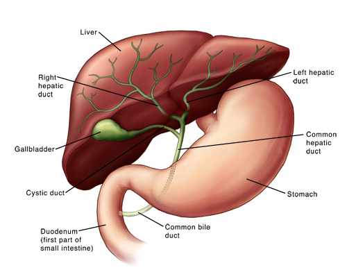

---
jupyter:
  jupytext:
    text_representation:
      extension: .md
      format_name: markdown
      format_version: '1.3'
      jupytext_version: 1.14.4
  kernelspec:
    display_name: py36tf
    language: python
    name: py36tf
---

# CT Liver Segmentation with Image Processing


CT scans of the liver and biliary tract (the liver, gallbladder, and bile ducts) can provide more detailed information about the liver, gallbladder, and related structures than standard X-rays of the abdomen, thus providing more information related to injuries and/or diseases of the liver and biliary tract.



Source : https://www.hopkinsmedicine.org/health/treatment-tests-and-therapies/computed-tomography-ct-or-cat-scan-of-the-liver-and-biliary-tract


The segmentation of Liver, although the largest organ visible in the abdomen CT, is challenging to segment. This is mainly due to the varying levels of intensities of the CT Images, as well as due to the presence of other organs such as Gallbladder in close vicinity. Whilst there are numerous Liver Segmentations done and available in the open domain, they are mostly through utilization of CNNs (Convoloutional Neural Networks) on large datasets. However, as mentioned in this link https://theaisummer.com/medical-image-python/, the goal here is to rather rely on basic Image Processing Algorithms than CNNs.  


One size doesn't fit all, at least, that is yet again reaffirmed during this segmentation exercise. However, the Python Notebook Liver_Segmentation_Final.ipynb code arrived at is the result of various different combination of image processing algorithms. One key aspect is the conversion of the DICOM Images to RGB (https://medium.com/analytics-vidhya/how-to-convert-grayscale-dicom-file-to-rgb-dicom-file-with-python-df86ac055bd
) in order to utilize the powerful features of Open CV Visualization methods. 


The CT Scan DICOM Images were downloaded from the website https://www.ircad.fr/research/data-sets/liver-segmentation-3d-ircadb-01/ (17th case out of the 20 cases available). This source contains a table that also indicates the major difficulties liver segmentation software may encounter due to the contact with neighbouring organs, an atypical shape or density of the liver, or even artefacts in the image. From the four sub folders available for each case, the "PATIENT_DICOM" and "LABELLED_DICOM" has been utiized for this exercise. The PATIENT_DICOM Folder contains the anonymized patient image in DICOM format, and the LABELLED_DICOM, the labelled image corresponding to the various zones of interest segmented in DICOM format.


In order to tackle the difficulties encountered in this Liver Segmentation, the following steps were taken:-

(a) There the quality of the CT Images was greatly dependent on the chosen CT Hounsfield Window, and hence, varied accordingly. In fact, it was seen that for Image Positions until 170 mm, the CT Window chosen was [150,88] as recommended in the website https://radiopaedia.org/articles/windowing-ct. For Image positions greater  than 170 mm, the CT Window of [150,30] referred in the journal publication https://pubmed.ncbi.nlm.nih.gov/23706868/ was suitable.  


(b) The mean HU Value in the Hounsfield Distribution of the Image was chosen as a criteria for the variation in Binary Threshold, after limiting the Hounsfield Distribution to values between 0 and 150, the Soft Tissue region. 


(c) To isolate the Liver from the brighter Gallbladder, depending on the mean HU Value, the Image was clipped to remove whiter portions with the highest intensities. To increase the quality of the Image, the Binary Threshold cv2.THRESH_BINARY values had to be adjusted depending on the brightness and contrast of the Image. 

(d) Minimum Area and Centroid location Filters on Contours were introduced for cv2.drawContours to isolate the Liver contour. The Centroid of the Liver was approximated to be in the upper left or upper central area of the CT, based on the LABELLED_DICOM images for different CT Slices. 

(e) With increasing value of Image Position, in the range from 165 to 170, there were two Liver contours, and hence, the code was made suitable to select the largest two contours in the CT, under the above existing area and centroid filter conditions.


Liver Segmentation for Image_100.dcm


**Way ahead and Improvements**
While this exercise has focussed only in segmentation of the Liver contour, the ROI (Regions of Interest) is a lot more, and includes other organs, measurements of size, detection of tumours and many other vital applications. The goal here has been to explore how DICOM Images can be processed through different criteria towards achieving Segmentation results. There are already Web applications many similar Segmentations, and further applications as well as improvizations would need a lot more study.

```python

```
